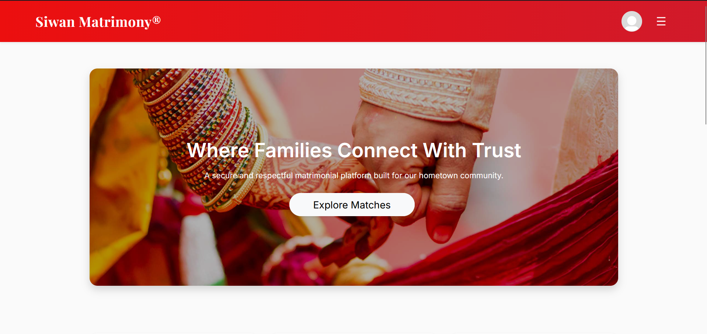
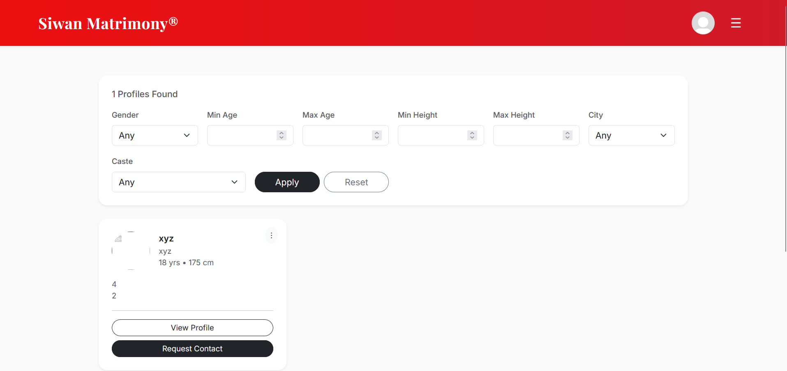

# Siwan Matrimony

A community-focused matrimonial web application built with Django that enables users to create profiles, discover compatible matches, and connect through a secure request-based system.

The project was initially designed for the Siwan community but is structured to support expansion to additional cities and communities.

## Features

### User Authentication
- User registration and login
- Profile editing
- Admin approval for newly registered users
- Email verification (Resend API)
- Secure logout

### Matchmaking
- Browse verified and approved profiles
- Automatic opposite-gender filtering
- Filter by:
  - Age
  - Height
  - City
  - Caste
- Pagination for profile listing

### Contact Requests
- Send contact requests
- Accept or reject requests
- Cancel pending requests
- Prevent duplicate requests
- Unlock contact details after acceptance

### User Safety
- Block users
- Report users
- Save favourite profiles
- Suspended users are hidden from matchmaking
- Blocked users cannot view or interact with each other

### Administration
- Admin approval system
- Manual email verification (current deployment)
- User suspension
- Django Admin integration

## Tech Stack

- Python
- Django
- PostgreSQL (Neon)
- Bootstrap 5
- HTML
- CSS
- Resend Email API
- Render

## Screenshots

### Homepage



### Matchmaking



## Installation

Clone the repository

```bash
git clone https://github.com/yourusername/siwan-matrimony.git
```

Navigate to the project

```bash
cd siwan-matrimony
```

Create a virtual environment

```bash
python -m venv venv
```

Activate it

Windows

```bash
venv\Scripts\activate
```

Linux / macOS

```bash
source venv/bin/activate
```

Install dependencies

```bash
pip install -r requirements.txt
```

Create a `.env` file

```env
SECRET_KEY=your_secret_key

DATABASE_URL=your_database_url

RESEND_API_KEY=your_resend_api_key
```

Apply migrations

```bash
python manage.py migrate
```

Create an admin account

```bash
python manage.py createsuperuser
```

Run the development server

```bash
python manage.py runserver
```

## Deployment

The application is deployed on Render with:

- PostgreSQL database hosted on Neon
- Environment variables managed through Render
- Static files served using WhiteNoise
- Email verification powered by Resend

## Security

- Environment variables stored securely
- CSRF protection
- Authentication required for protected routes
- Admin approval before matchmaking access
- Email verification
- User blocking and reporting system
- Hidden contact details until request acceptance

## Future Improvements

- Custom domain for production email verification
- Real-time notifications
- Chat system
- Mobile responsive improvements
- Profile compatibility scoring
- Interest-based recommendations

## Author

Aditya Kumar

GitHub: https://github.com/aditya081105
